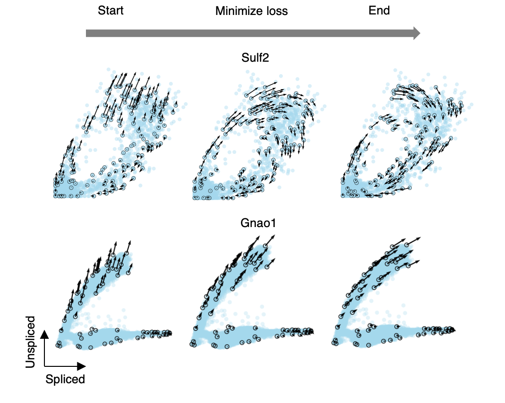

cellDancer - Estimating Cell-dependent RNA Velocity
===========================================================================================

**cellDancer** is a modularized, parallelized, and scalable tool based on a deep learning framework for the RNA velocity analysis of scRNA-seq. Our website of tutorials is available at `cellDancer Website <https://guangyuwanglab2021.github.io/cellDancer_website/>`_.

Cite

Shengyu Li#, Pengzhi Zhang#, Weiqing Chen, Lingqun Ye, Kristopher W. Brannan, Nhat-Tu Le, Jun-ichi Abe, John P. Cooke, Guangyu Wang. A relay velocity model infers cell-dependent RNA velocity. Nature Biotechnology (2023) https://doi.org/10.1038/s41587-023-01728-5

cellDancer's key applications
========================================================
* Estimate cell-specific RNA velocity for each gene.
* Derive cell fates in embedding space.
* Estimate pseudotime for each cell in embedding space.

What's new
========================================================
cellDancer is updated to v1.1.7

* Added progress bar for adata_to_df_with_embed() and adata_to_raw().
* Added try except to catch genes with low quality in velocity().

Installation
========================================================
cellDancer requires Python version >= 3.7.6 to run.

To run cellDancer locally, create an `conda <https://docs.conda.io/en/latest>`_ or `Anaconda <https://www.anaconda.com/>`_ environment as ``conda create -n cellDancer python==3.7.6``, and activate the new environment with ``conda activate cellDancer``. cellDancer could be installed with ``pip install celldancer``.

To install cellDancer from source code, run:
``pip install 'your_path/Source Code/cellDancer'``.

For M1 Mac users if you encountered a problem while installing bezier. Please refer to the following link:
https://bezier.readthedocs.io/en/2021.2.12/#installing

If any other dependency could not be installed with ``pip install celldancer``, try ``pip install --no-deps celldancer``. Then install the dependencies by ``pip install -r requirements.txt``.

